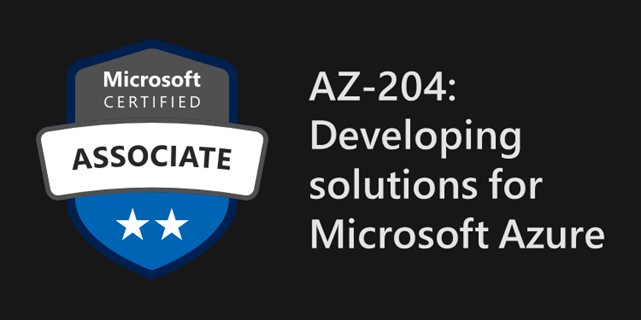

# Microsoft Learning Paths about AZ-204

## Welcome to my repository! 👋👋
This repository contains learning paths and their respective labs from Microsoft Learn about the AZ-204 (Developing Solutings for Microsoft Azure). You can find all the information at the original repository: [AZ-204: Developing Solutions for Microsoft Azure](https://github.com/MicrosoftLearning/AZ-204-DevelopingSolutionsforMicrosoftAzure.git).

### Learning Path 01: Implement Azure App Service Web Apps 🌐
- [LAB 01 - Build a new web application on Azure Platform as a Service offerings.](https://github.com/dCruzCoding/MicrosoftLabs-AZ204/tree/main/Lab01)
Creating a Web API that connects to an Azure storage container to manage images, along with a Frontend that interacts with the API.
Instructions here: [📋](https://microsoftlearning.github.io/AZ-204-DevelopingSolutionsforMicrosoftAzure/Instructions/Labs/AZ-204_lab_01.html)

### Learning Path 02: Implement Azure Functions ⚡
- [LAB 02 - Implement task processing logic using Azure Functions.](https://github.com/dCruzCoding/MicrosoftLabs-AZ204/tree/main/Lab02) 
Creating an Azure Function App and deploy a project that contains three distinct functions:  Echo Function (HTTP Trigger) to return POST content, a Recurring Function (Timer Trigger) to log timestamps every "x" minutes, and a GetSettingInfo Function (HTTP Trigger) to retrieve data from a settings json file stored in Azure.
Instructions here: [📋](https://microsoftlearning.github.io/AZ-204-DevelopingSolutionsforMicrosoftAzure/Instructions/Labs/AZ-204_lab_02.html)

### Learning Path 03: Develop solutions that use blob storage 🗃️
- [LAB 03 - Retrieve Azure Storage resources and metadata by using the Azure Storage SDK for .NET.](https://github.com/dCruzCoding/MicrosoftLabs-AZ204/tree/main/Lab03) 
Using Azure Storage SDK in a .NET project to access Azure Storage containers and get their contents.
Instructions here: [📋](https://microsoftlearning.github.io/AZ-204-DevelopingSolutionsforMicrosoftAzure/Instructions/Labs/AZ-204_lab_03.html)

### Learning Path 04: Develop solutions that use Cosmos DB storage 🌌
- [LAB 04 - Construct a polyglot data solution.](https://github.com/dCruzCoding/MicrosoftLabs-AZ204/tree/main/Lab04) 
Connecting an Azure Cosmos DB account to local and Azure Storage using the .NET SDK, along with creating a local web application to display the data.
Instructions here: [📋](https://microsoftlearning.github.io/AZ-204-DevelopingSolutionsforMicrosoftAzure/Instructions/Labs/AZ-204_lab_04.html)

## License

This project is licensed under the MIT License. See `LICENSE` file for more details.

Copyright (c) 2020 Microsoft

Permission is hereby granted, free of charge, to any person obtaining a copy
of this software and associated documentation files (the "Software"), to deal
in the Software without restriction, including without limitation the rights
to use, copy, modify, merge, publish, distribute, sublicense, and/or sell
copies of the Software, and to permit persons to whom the Software is
furnished to do so, subject to the following conditions:

The above copyright notice and this permission notice shall be included in all
copies or substantial portions of the Software.
